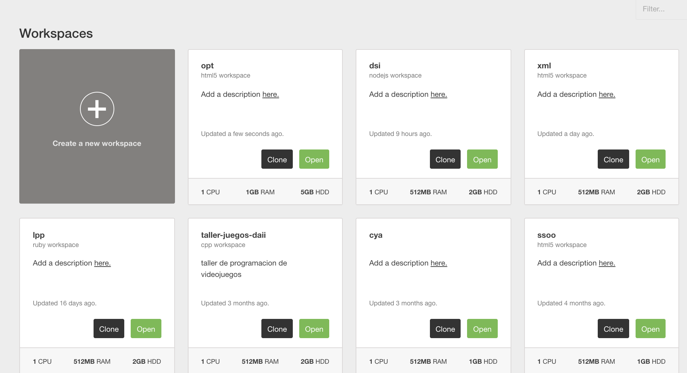
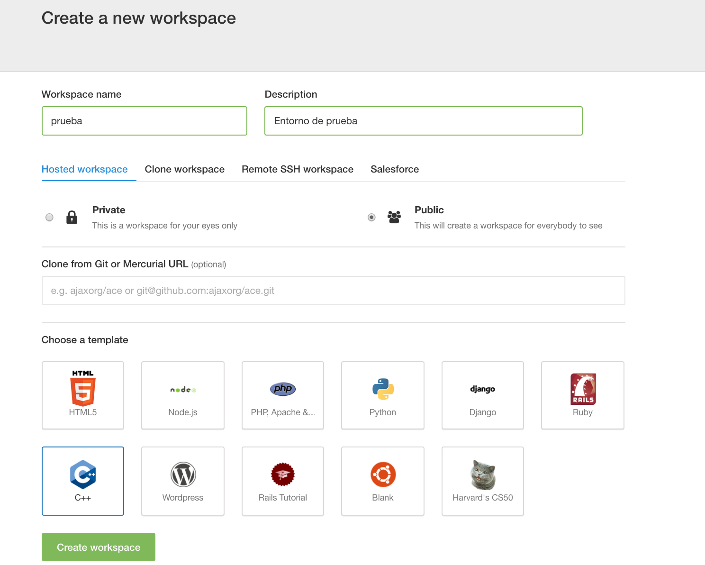
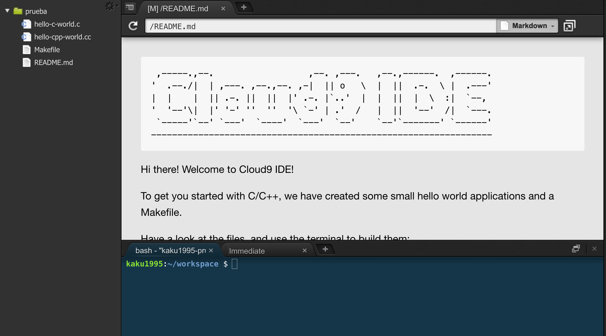

# Cloud 9.

## Introducción.

  Cloud 9 es un entorno de desarrollo en la nube basado en ubuntu. Nos permite crear un entorno ubuntu
que nos proporciona un explorador de archivos, una consola y un editor de texto. Para su uso solo es necesario
entrar a la página de [Cloud 9](c9.io) y registrarse.

.

## Uso Básico.

  En su pantalla de inicio se nos mostrarán todos nuestros entornos de trabajo, así como la posibilidad de crear uno nuevo.

  Para crear un entorno nuevo, será necesario elegir un nombre y a continuación se nos proporcionarán una serie de plantillas
según el uso que queramos hacer del entorno.

  Al crear el entorno ya podrémos empezar a trabajar como si fuese una consola linux normal y corriente, con la ayuda de un explorador de archivos y un editor de texto.

