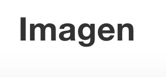

# Markdown

## Introducción.

  Markdown es un método de escritura que tiene como objetivo mantener una forma sencilla y legible de escribir, con
la posibilidad de añadir formatos como negrita, enlaces, imágenes etc, mediante únicamente texto plano.
Nos proporciona una forma sencilla de construir documentos html(tras una conversión como podría ser usando [Pandoc](../capituloPandoc/Pandoc.html)
o [Gitbook](../capituloX/Gitbook.html)).

## Uso Básico.

Para dar formato al texto que queremos incluir en nuestro documento, será necesario realizar pequeños cambios al documento:

Para añadir un titulo o subtitulo utilizamos \# una o más veces
*  \# Titulo
  # Titulo
*  \## Subtitulo
  ## Subtitulo
*  \###Subtitulo
  ### Subtitulo

Para añadir un texto en negrita, escribimos un doble \* antes y después del texto.
* \*\*Negrita\*\*

  **Negrita**

Para añadir texto en cursiva, escribimos un \* antes y despues del texto.  
* \*Cursiva\*

  *Cursiva*

Para añadir tanto negrita como cursiva a un texto, utilizamos un triple \* antes y despues del texto.
* \*\*\*Negrita y cursiva\*\*\*

  ***Negrita y cursiva***

Para crear una lista, o enumerar, escribimos al empezar el renglon \* , \-, o \+.
* Listas:

  \* Elemento 1

  \* Elemento 2

  * Elemento 1
  * Elemento 2

Para añadir enlaces a nuestro texto, escribiremos la palabra que queremos que aparezca en el texto entre corchetes \[\]
y entre paréntesis escribimos la dirección \(\).

* \[Enlace\]\(Markdown.html\)

  [Enlace](Markdown.html)  

Para añadir imagenes a nuestro texto, debemos incluir la imagen igual que los enlaces, pero añadiedo un signo de exclamación
antes \! .

* \!\[Imagen\]\(Imagen.png\)

  
