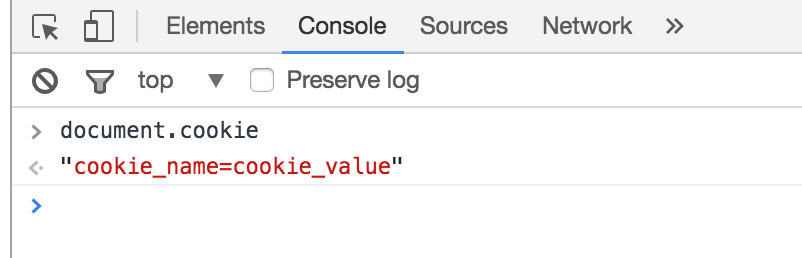
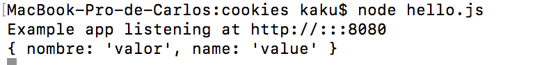

# Cookies

Un cookie es un pequeño fragmento de codigo enviado por una página y almacenado en el navegador. Cada vez que el usuario entra en la página, el navegador reenvia el cookie para identificar al usuario.
Es necesario instalar el middleware cookie-parser para comenzar a trabajar con ellos:
~~~
npm install cookie-parser --save
~~~

Para importar un cookie a nuestra aplicación:

~~~
var express = require('express');
var cookieParser = require('cookie-parser');
var app = express();

app.use(cookieParser());
~~~

Podemos incluir un nuevo cookie usando la siguiente sintaxis:

~~~
app.get('/cookie',function(req, res){
     res.cookie('cookie_name', 'cookie_value')
       "Estoy creando un cookie nuevo");
});
~~~

Escribiendo en la consola del navegador **'document.cookie.'** podemos ver los cookies que tenemos en uso.

También podemos obtenerlo con el método **'req.cookies'**.

~~~
app.get('/', function(req, res) {
  console.log("Cookies :  ", req.cookies);
});
~~~

Si lo que queremos es ponerle un tiempo para que expire el cookie podemos usar la opcion expire o maxage:

~~~
res.cookie('cookie_name', 'cookie_value', {expire : new Date() + 9999});
res.cookie('cookie_name', 'cookie_value', {maxAge : 9999});
~~~

Por último, si queremos borrar un cookie, podemos usar ***'clearCookie('nombre')'***

~~~
app.get('/clearcookie', function(req,res){
     res.clearCookie('cookie_name');
     res.clearCookie(cookiess);
     res.clearCookie(setCookie);
     res.send('Cookie deleted');
});
~~~

## Cookie Module

Para su uso primero es necesario instalar su modulo.

~~~
npm install cookie --save
~~~

 y para su uso:

~~~
var cookie = require('cookie');
~~~

### Cookie.parse.

Con el método parse, podemos pasarle una lista de cookies y nos devolverá un objeto que contenga cada par nombre-valor:

~~~
var cookies = cookie.parse('nombre=valor; name=value');
~~~

Que podremos mostrar por ejemplo por consola:

~~~
app.get('/cookiess',function(req, res){
        console.log(cookiess)
});
~~~

Además, se le pueden añadir la opción ***'decodeURIComponent'*** para decodificar el cookie.

### Cookie.serialize.

Permite crear una cadena de ayuda que contiene el par nombre-valor.

~~~
var setCookie = cookie.serialize('nombres', 'valores');
~~~

Podemos mostrarlo igual que los creados con Cookie.parse

Este método acepta opciones como tercer atributo:

* domain. Indica el valor del dominio donde se aplica.
* encode. Codificar el valor del cookie.
* expire. Indica hasta cuando funciona el cookie.
* httpOnly. Para activar dicha opción en el cookie.
* maxAge. Indicando el numero de segundos. Se producirá la cuenta atrás.
* path. Para indicar el path por defecto.
* secure. Si el navegador no tiene conexión https no reenvia el cookie.
