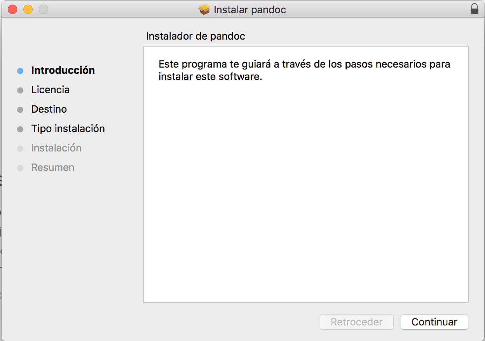

# Pandoc

## Introducción
  Pandoc es una herramienta de codigo abierto que nos facilita la conversión de documentos de forma rapida
y efectiva.

## Instalación.

  Para su instalación en mac os, será necesario descargar el ejecutable proporcionado desde la página web
oficial de [Pandoc](https://github.com/jgm/pandoc/releases/tag/1.19.2.1), y seguir las instrucciones proporcionadas
por este.

## Uso Basico.

  Algunos comandos básicos para el uso de Pandoc son:

* pandoc <nombre_markdown> -f markdown -t html -s -o <nombre_html>. Nos permite convertir un documento del formato markdown al
formato html.
* pandoc <nombre_html> -f html -t markdown -s -o <nombre_markdown>. Nos permite convertir un documento del formato html al
formato markdown.
* pandoc --help. Proporciona algunos comandos básicos de pandoc, así como sus posibles opciones.
