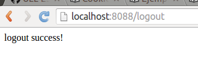

#Un ejemplo de autenticación de sesión en node.js con express.js

* **Autenticación** es el proceso de verificar si el usuario es de hecho quien se declara ser.
* **Autorización** es el proceso de determinar si el usuario tiene los privilegios para acceder a los recursos que ha solicitado.

A continuación, se mostrará un ejemplo de código node.js de proceso de autenticación y autorización mediante session en express.js. En él hay un login, un logout y un get para publicar la página. Para ver la el post de la página, primero tenemos que iniciar sesión y así nuestra identidad será verificada y guardada. Cuando hagamos el logout, nuestra identidad se borrará.

Nombre del fichero: **session_auth.js**

~~~
//Importamos los modulos express y express-session. Creamos una variable de express (app) y una de sesión (session).
var express = require('express'),
    app = express(),
    session = require('express-session');
app.use(session({
    secret: '2C44-4D44-WppQ38S',
    resave: true,
    saveUninitialized: true
}));
 
//Función Middleware de Autenticación y Autorización. 
//Concede el siguiente paso si el usuario es amy y si tiene acceso de administrador.
var auth = function(req, res, next) {
  if (req.session && req.session.user === "amy" && req.session.admin)
    return next();
  else
    return res.sendStatus(401);
};
 
//Login
//La sesión será diferente para cada usuario, y también será única para el mismo usuario utilizando diferentes navegadores.
app.get('/login', function (req, res) {
  if (!req.query.username || !req.query.password) {
    res.send('login failed');
  } else if(req.query.username === "amy" || req.query.password === "amyspassword") {
    req.session.user = "amy";
    req.session.admin = true;
    res.send("login success!");
  }
});
 
//Logout
//Destruye la sesión.
app.get('/logout', function (req, res) {
  req.session.destroy();
  res.send("logout success!");
});
 
//Get
//Obtiene el contenido protegido. La función de autenticación anterior se pasa en el segundo parámetro como middleware antes de proceder a servir el contenido al usuario. Si la función auth determinó que el usuario no es válido, no pasará a la tercera función para servir el contenido.
app.get('/content', auth, function (req, res) {
    res.send("You can only see this after you've logged in.");
});
 
//Iniciamos la aplicación escuchando en el puerto 8088.
app.listen(8088);
console.log("app running at http://localhost:8088");
~~~

Para poder compilar el ejemplo anterior, debemos instalar express y express-session:
~~~
npm install express
npm install express-session
~~~

Ahora podríamos ejecutar el fichero con el comando ~~~node session_auth.js~~~.

Una vez con el servidor corriendo, podemos acceder a las siguientes direcciones:
~~~
localhost:8088/content
~~~

~~~
localhost:8088/login?username=amy&password=amyspassword~
~~~

~~~
localhost:8088/content
~~~

~~~
localhost:8088/logout
~~~

~~~
localhost:8088/content
~~~

