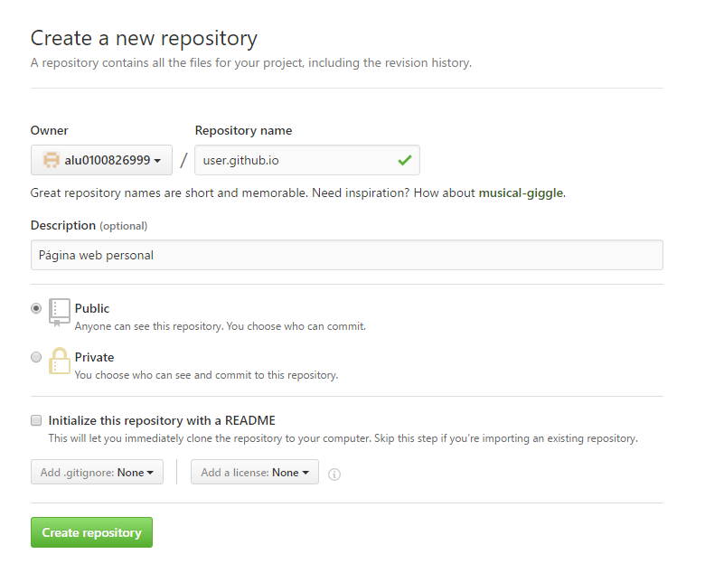

# gh-pages
## Introducción

GitHub Pages (gh-pages) es un servicio de alojamiento gratuito que ofrece GitHub para alojar nuestros proyectos en un sitio web. Sirve tanto para un portafolio, landing page e incluso para crear un blog. Todo de manera gratuita y con repositorios ilimitados. 

## Uso para usuarios u organizaciones
En primer lugar, debemos crear un repositorio con el nombre: nombreusuario.github.io. Dicho repositorio debe comenzar con nuestro nombre de usuario u organización seguido de github.io.

A partir de esto, podemos empezar a generar nuestros commits, tal como hemos visto en capítulos anteriores, haciendo un "git clone URL-remoto" o "git remote add rama-remota URL-remoto".

Ahora ya podemos ver todos los cambios dentro del repositorio remoto en la dirección https://nombreusuario.github.io.

## Uso para proyectos
Vamos [Github](https://github.com/) y creamos un nuevo repositorio (seguir los pasos descritos en el capítulo de Github) o también podemos utilizar uno ya creado anteriormente. En nuestro caso vamos a coger uno ya existente.

* Vamos a crear la rama gh-pages: git branch gh-pages.

* Ahora empujamos los cambios de nuestrto repositorio local al remoto (Github): git push origin gh-pages.

* Ahora ya podemos ver los cambios entrando en: http://nombreusuario.github.io/nombrerepositorio.

Por otro lado, podemos **automatizar el despliegue de gh-pages** de la siguiente forma:
* Hacemos: npm install gh-pages --save-dev.
* Ahora debemos crear un fichero llamado deploy.js e introducir las siguietne lineas de código:

var ghpages = require('gh-pages');
var path = require('path');
 
ghpages.publish(path.join(__dirname, '_book'), function(err) {
  console.log("publicación finalizada");
});

* Una vez tengamos el archivo deploy.js listo, ya podemos ejecutar el siguiente comando para publicar todos los nuevos cambios desde la rama gh-pages:
npm run deploy