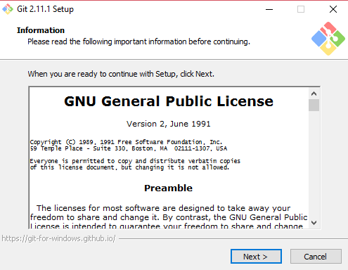

# Git
## Introducción

Git es un softare de control de versiones. Nos permit crear y mantener un control de versiones de un proyecto o aplicación.
Facilita un desarrollo no lineal, eficiente y ordenado, con gestión de ramas y su mezclado.

## Instalación

Podemos instalar git en varios sistemas operativos como:

### Windows:
En este [enlace](https://git-for-windows.github.io/) podemos acceder a la descarga del instalador de git para mac. Al descargarlo, la instalación en el pc será algo como esto:

### Mac:
En este [enlace](https://sourceforge.net/projects/git-osx-installer/files/git-2.10.1-intel-universal-mavericks.dmg/download?use_mirror=autoselect) podemos acceder a la descarga del instalador de git para mac. Al descargarlo, la instalación en el pc será algo como esto:

### Linux:
Para instalar Git en Linux, podemos hacerlo mendiante la terminal con el comando:

apt-get install git

## Uso Básico

#### Crear un repositorio local
git init

#### Vincular nuestro repositorio local al remoto
git clone URL-repositorio. Clonar en nuestra máquina local un repositorio remoto.

git remote add rama URL-repositorio. Crear una rama remota que nos permita hacer push o pull al repositorio remoto especificado.

#### add y commit
git add nombrefichero o git add . Registrar nuestros cambios, o de un fichero en concreto o de todos los cambios realizados desde los últimos cambios añadidos.

git commit -m "Mensaje". Agregar un mensaje (commit) a los cambios añadidos.

git log. Para visualizar un grafo de las confirmaciones realizadas en el repositorio.

#### Envío de cambios
git push origin master. Siendo origin la rama remota creada con el comando "git remote add rama" y master la rama local.

#### Ramas
git branch rama. Para crear una rama nueva.

git checkout rama. Para posicionarnos en una rama.

git checkout -b rama. Para crear y posicionarnos en una rama.

git branch -d rama. Para borrar una rama.

#### Actualizar y fusionar
git pull. Actualiza en el repositorio local al commit más nuevo del repositorio remoto.

git merge rama. Para fusionar la rama activa (master por ejemplo) con la rama especificada.

git fetch rama. Para deshacer todos los cambios realizados en el repositorio local y traer la última versión guardada en el repositorio remoto. En este caso, "rama" será la rama del repositorio remoto.
