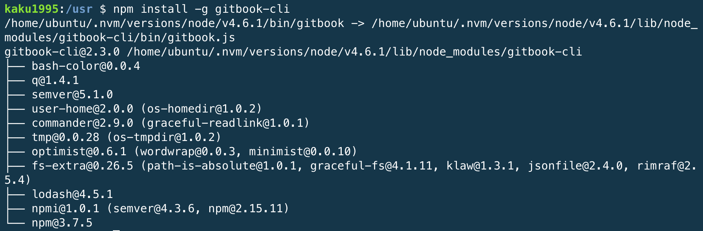
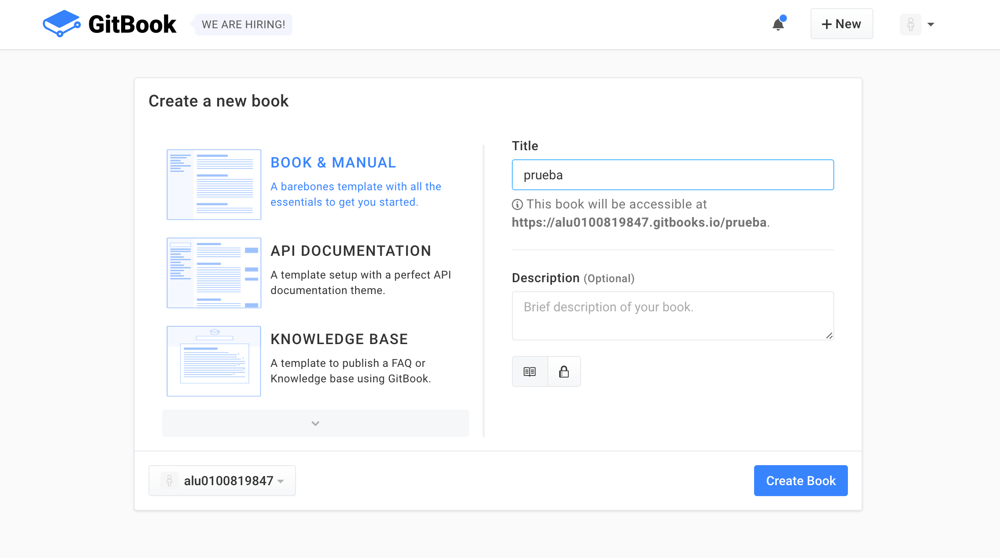
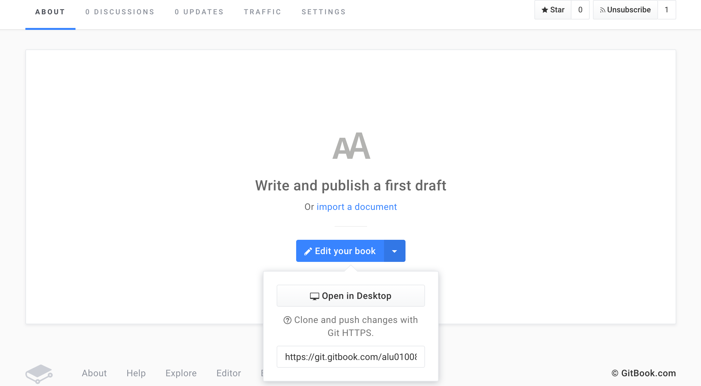
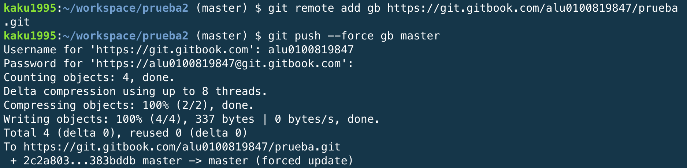
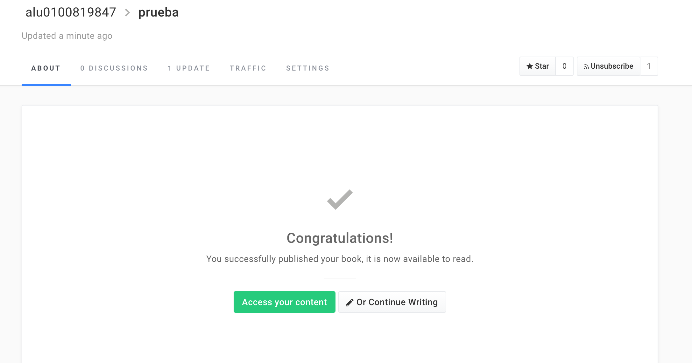

# Gitbook
## Introducción

Gitbook es una herramienta implementada usando NodeJs que permite la creación simple de libros y documentación de proyectos
haciendo uso de Markdown. Mediante ficheros con extensión .md gitbook compondrá el libro deseado, además nos da la posibilidad de
crear tanto pdf, ebook o web.

## Instalación.

Para su instalación es necesario tener instalado [node.js](../capitulo1/nodejs.html), y el comando necesario sera:
npm install -g gitbook-cli, pudiendo solicitar el uso de sudo, sudo npm install -g gitbook-cli.
En este caso la forma de instalación es la misma tanto para linux como para mac os.

.

## Uso Básicos

Algunos comandos básicos para el uso de **gitbook** pueden ser:
* gitbook init <nombre_libro>. Crea la estructura básica para el desarrollo del libro.
* gitbook build. Compondrá un html con el conjunto de ficheros en formato Markdown dentro del directorio.
* gitbook serve. Compondrá un html lanzará un servidor local en el puerto 4000 desde el que tendremos acceso al libro.

## Gitbook.com

Para crear un libro en gitbook.com, es necesario estar registrado en la página de gitbook:

A continuación, en el menú principal se selecciona la opción de New Book:

Seleccionar un tipo de documento y nombre:

De esta manera, ya tenemos creada la estructura básica, y podemos añadir nuestros documentos como si fuese un repositorio normal
de github:

Y ya tendríamos incluido el libro.
