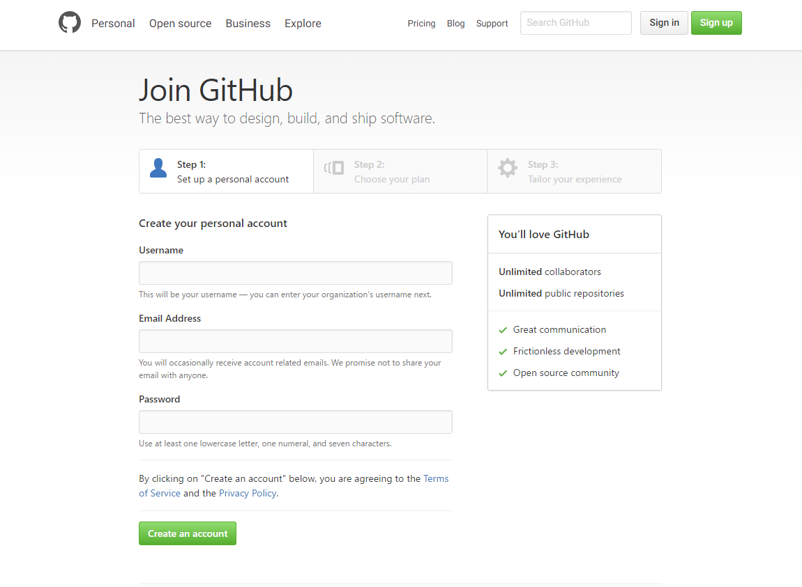
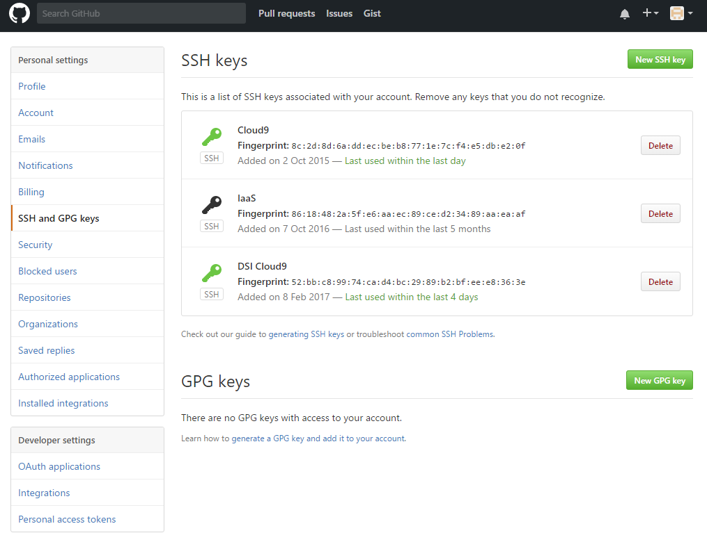
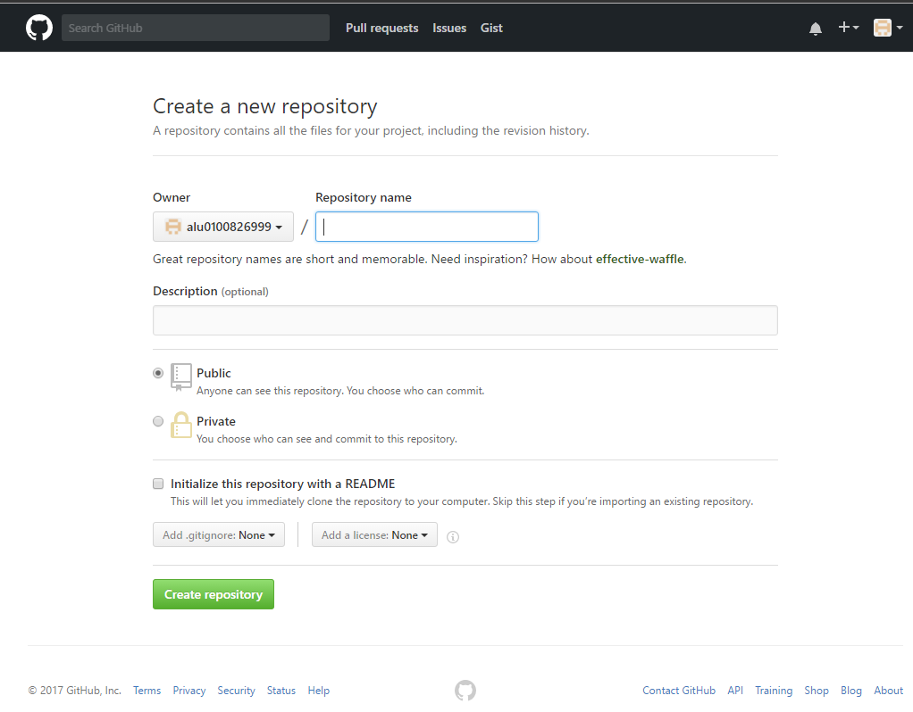
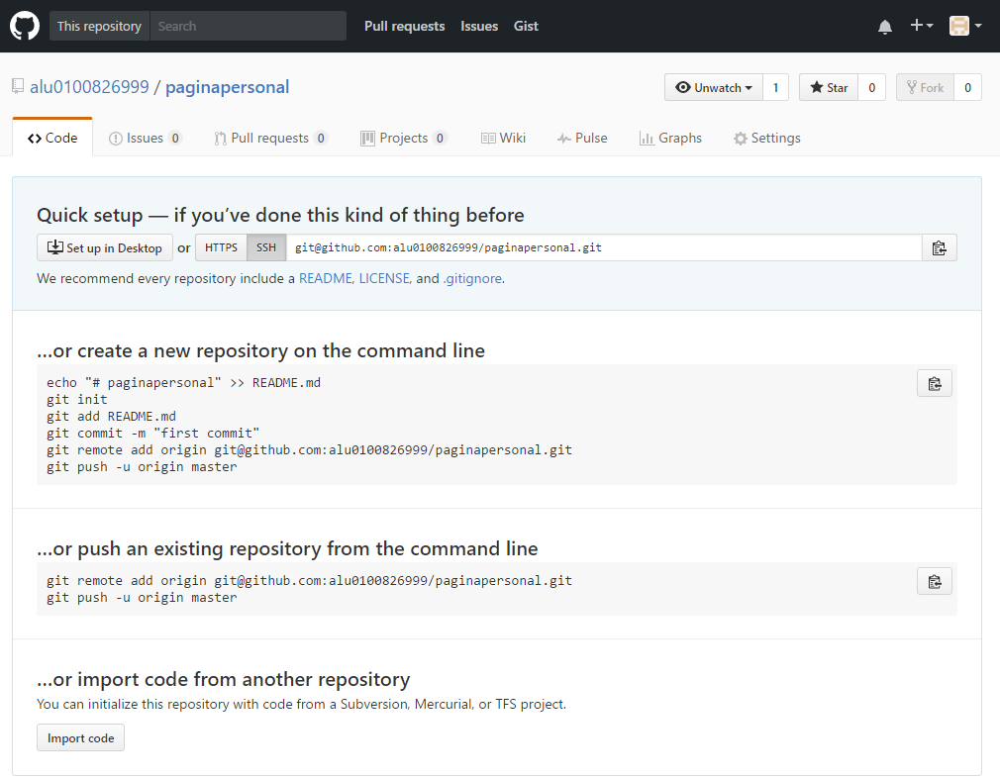
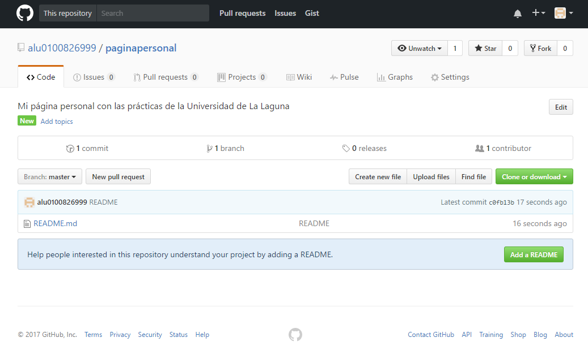

# Github
## Introducción

Github es un hosting para git, gratuito para proyectos opensource.

Vamos a ver cómo configurar el entorno local para trabajar con github y cómo realizar una primera subida de un proyecto al repositorio.

## Crear una cuenta
* Entramos a [Github](https://github.com/)

* Creamos una cuenta:

## Uso Básico
* En primer lugar, para poder trabajar con Github, debemos tener instalado Git en nuestro repositorio local (mirar capítulo Git). Para poder vincular nuestra terminal con el repositorio remoto de github, debemos seguir los siguientes pasos:

* Creamos un directorio con nombre copia dentro del directorio .ssh: mkdir ~/.ssh/copia.

* Movemos la pareja clave-pública clave-privada al directorio copia: mv ~/.ssh/id_rsa* ~/.ssh/copia/.

* Generar una nueva pareja de clave-pública clave-privada en el directorio .ssh (ssh-keygen -t rsa). Para usar las opciones por defecto, a cada pregunta responda pulsando la tecla de retorno de carro.

* Mostramos por consola la clave-pública que se ha generado: cat ~/.ssh/id_rsa.pub y la copiamos.

Ahora debemos dirigirnos a github para añadir la clave-pública a Github:

* En la barra de usuario, en la esquina superior derecha de la página, hacemos clik en el icono de Settings.

* En la barra de opciones que aparece en a la izquierda haga clik en la etiqueta “Claves SSH” (SSH Keys).

* Hacer clik en el botón “Add SSH key” que aparece a la derecha.

* En el campo de texto Título (Title) debemos escribir un título identificativo para dicha clave.

* En el área de texto Clave (Key) debemos pegar la clave-pública copiada anteriormente.

* Pulse el botón verde para crear la clave (Add key).

Una vez vinculado nuestro repositorio local con Github, debemos crear un repositorio:

* En la barra de usuario, en la esquina superior derecha de la página, hacemos clik en el icono de “Crear un repositorio nuevo” (Create a New Repo).

* Introducimos un nombre para el repositorio y seleccionamos que el repositorio sea público, ya que crear un repositorio privado no es gratuito.

* Pulsar el botón para crear el repositorio (Create repository).

* Ahora debemos copiar la dirección “ssh” del repositorio (Ctrl+C).

Ahora es el momento de crear una rama remota desde nuestra terminal (el repositorio local), con el comando git remote add rama-remota URL-repositorio-remoto (para más información ver el capítulo de Git).
Por último, empujamos los cambios en el repositorio local al remoto: git push -u rama-remota master.

Este sería el aspecto del repositorio después de haber seguido estos sencillos pasos:

Por otro lado, tenemos **hub**. Hub es una herramienta de línea de comandos que envuelve git con el fin de ampliarlo con funciones y comandos adicionales que facilitan el trabajo con GitHub.

Para instalarlo en nuestro repositorio local, en la terminal, debemos seguir los siguientes pasos:

* Clonar el repo de hub a nuestro repositorio local: git clone "git@github.com:github/hub.git".
* Instalar hub: script/build -o ~/bin/hub.
* Podemos añadir un alias para trabajar tanto con git como con hub: alias git=hub.

Ya podemos utilizar el comando hub. Para comprobar que está instalado correctamente, hacemos: hub --version.
