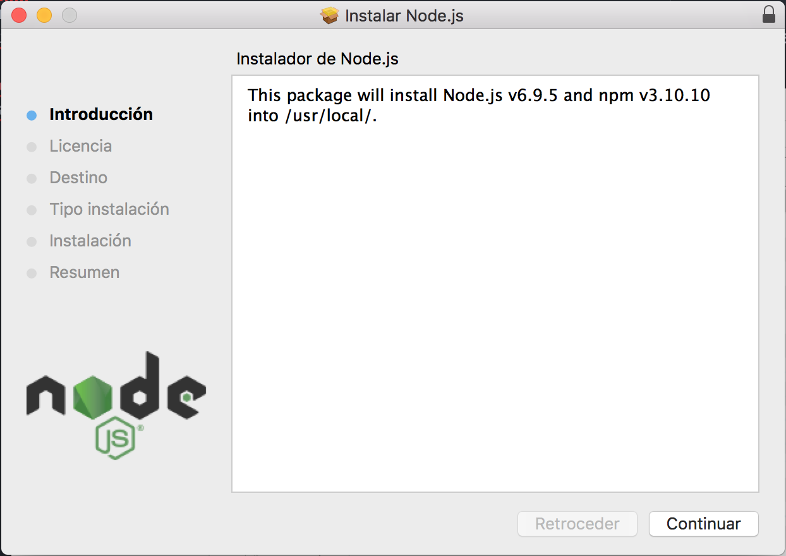
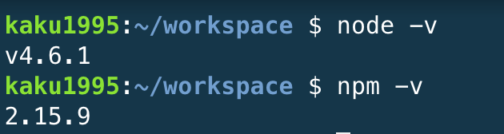

# Node Js
## Introducción.

NodeJs es un entorno de ejecución de java basado en el motor de JavaScript V8 de Chrome.
NodeJs utiliza como manipulador de paquetes por defecto npm, poseyendo grandes librerías de codigo abierto a su disposición.

## Instalación.

Para su instalación es necesario descargar el instalador en su propia [página](https://nodejs.org/es/) y seguir las instrucciónes que se van indicando.

En caso de utilizar plataformas como c9, el nodejs ya vendrá preinstalado y podemos comprobar su versión:

   

## Uso Básico

Algunos comandos básicos para **npm** podrían ser:

* npm install . Este comando nos permite instalar todas las dependencias encontrados en el fichero package.json.
* npm install <nombre>. Se instala el paquete deseado.
* npm install -g <nombre>. Se realiza la instalación del paquete deseado de forma global.
* npm install <nombre> --save-dev. Se realiza la instalación del paquete deseado como dependencia de desarrollo.
* npm --help. Se muestra la documentación respecto a npm.

El uso básico de **NodeJs** es:

* node. Se habre la consola de NodeJs.
* node nombrefichero.js. Se ejecuta el fichero de codigo JavaScript deseado.
* .exit. Salir de la consola de NodeJs.
