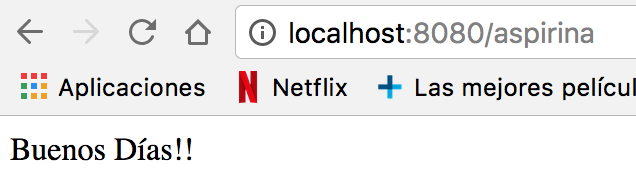
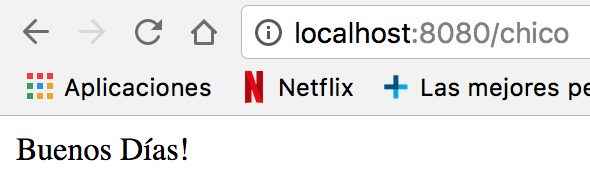
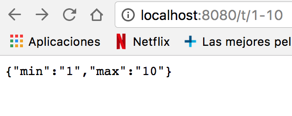
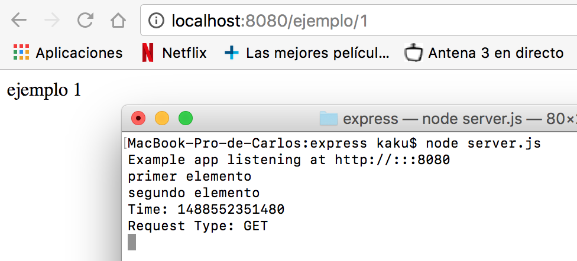
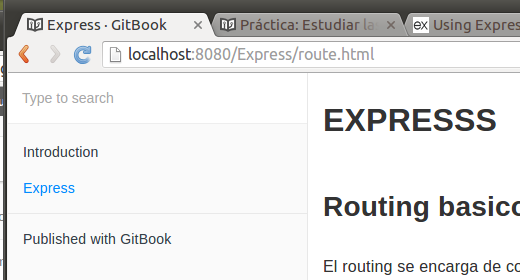

# EXPRESSS

## Routing basico

El routing se encarga de controlar como una aplicación responderá a una petición de un cliente.
Cada route tendra una o más respuestas y un path del server.

Cada route estará compuesto por una instancia de express, generalmente lo llamaremos *app*, un método http de respuesta, como put, post, get... y una o más funciones de respuesta.

Algunos ejemplos de routing pueden ser:

~~~
  app.post('/hello', function (req, res) {  
    res.send('Hello!!!')  
  })  

  app.get('/hello', function (req, res) {  
    res.send('Hello!!!')  
    })  
~~~
Con una salida:
  escribir salida.

Tambien tenemos algún método no derivado de los metodos http, que nos permite cargar funciones middleware con métodos request, como el método all.

Por ejemplo:
~~~
app.all('/secret', function (req, res, next) {  
  console.log('Accessing the secret section...')  
  next()  
})  
~~~
En este caso, no tenemos definida una función para next, y tampoco hemos definido un contenido que mostrar por el servidor, pero si un mensaje que mostrar en la consola cuando es llamado '/secret'.

  

Si además le definimos una función next:
~~~
app.all('/secret', function (req, res, next) {  
  console.log('Accessing the secret section...')  
}, function (req, res) {  
  res.send('Secreto')  
})  
~~~
Podremos obtener ambas salidas. En caso

  

## Multiple Handler

Haciendo uso de los http request methods también podemos definir estructuras un poco más complejas, con varias funciones de respuesta.
Por ejemplo podemos utilizar una función next para definir dos salidas.
~~~
app.get('/prueba/1', function(req, res, next) {  
  console.log('Ahora se dirigirá a la función con el seguiente mensaje')  
  next()  
}, function (req, res) {  
  res.send('Prueba 1 correcta')  
})  
~~~

o haciendo uso de variables, definir más de 2 salidas.
~~~
var ejemplo1 = function (req, res, next) {  
  console.log('primer elemento')  
  next()  
}  

var ejemplo2 = function (req, res, next) {  
  console.log('segundo elemento')  
  next()  
}  

var ejemplo3 = function (req, res) {  
  res.send('Se han registrado los 2 elementos')  
}  

app.get('/prueba/2', [ejemplo1, ejemplo2, ejemplo3])
~~~
 

O como forma alternativa.
~~~
 app.get('/prueba/3', [ejemplo1, ejemplo2], function(req, res, next){  
   console.log('Añadido otro elemento')  
   next()  
 }, function(req, res) {  
   res.send('Se han registrado 3 elementos')  
 })  
~~~

## Route Path.

Para las route Path, podemos utilizar expresiones regulares, de forma que podemos definir más de una ruta para una misma función.
Por ejemplo:

Si queremos que al escribir cualquier cadena que empiece por 'a', responda Buenos Dias!!.
~~~
app.get('/a*', function (req, res) {  
  res.send('Buenos Días!!')  
})  
~~~

O si queremos que responda lo mismo para 'chico' y 'chica'.
~~~
app.get('/chic[oa]', function (req, res) {  
  res.send('Buenos Días!')  
})  
~~~

Otra forma de manipular la route path es usando parámetros, y 'req.param':

Ejemplos:
~~~
app.get('/nombre/:nombre/apellido/:apellido', function (req, res) {  
  res.send(req.params)  
})  
~~~

~~~
app.get('/t/:min-:max', function (req, res) {  
  res.send(req.params)  
})  
~~~

# Middleware.

Una aplicación en express es básicamente una secuencia de middleware. Un middleware es una función que tiene acceso a una solicitud (request object), a una respuesta (response object) y al siguiente middleware, que es communmente denominado next.
El middleware toma el control, y en caso de no finalizar el ciclo de solicitudes, pasa el control al siguiente middleware, y así sucesivamente hasta que logra su objetivo.

## Application-level middleware.

Este tipo de middleware hace uso de instancias de express. Puede ser usado sin hacer uso de Path; en este caso, se ejecutaría cada vez que se realiza una request.

~~~
app.use(function (req, res, next) {
  console.log('Time:', Date.now())
  next()
})
~~~

y con el route definido:

~~~
app.post('/hey', function (req, res, next) {
  res.render('hey')
  next()
})
~~~

obtendremos por consola:

Al usar route path, se ejecutará en los middleware en los que coincida. Por ejemplos:

~~~
app.get('/ejemplo/1', [ejemplo1, ejemplo2], function(req, res, next){
  res.send('ejemplo 1')
  next()
})
~~~

##Router-level middleware

Este tipo de middleware funciona de la misma manera que el midleware anterior (Application-level middleware), excepto que este está enlazado a una instancia de express llamada Router ().

El siguiente ejemplo muestra el mismo ejemplo usado en el middlewarwe de nivel de aplicación pero usando un middleware de nivel de enrutador:

~~~
var router = express.Router()

app.use(function (req, res, next) {
  console.log('Time:', Date.now())
  next()
})
~~~

El siguiente ejemplo muestra una pila de middleware de nivel de enrutador usando get. En el caso de que el id del router sea 0, pasará al siguiente router, de lo contrario pasará el control a la siguiente función middleware de la pila:

~~~
router.get('/ejemplos/:id', function (req, res, next) {
  if (req.params.id === '0')  {
    next('route') 
  }
  else next()
})
~~~

Para montar el enrutador en la aplicación hacemos:

~~~
app.use('/', router)
~~~

## Error-handling middleware (middleware de manejo de errores)

Los middleware de manejo de errores siempre toman cuatro argumentos, son necesarios para identificarse como este tipo demiddleware. Aunque no sea necesario el uso de los cuatro argumentos, deben especificarse.

~~~
app.use(function (err, req, res, next) {
  console.error(err.stack)
  res.status(500).send('Something broke!')
})
~~~

## Built-in middleware (middlewear incorporado)

La única función middleware incorporada en Express es express.static. Esta función se basa en serve-static y es responsable de servir activos estáticos, como archivos HTML, imágenes, etc. Su sintáxis es:

~~~
express.static(root, [options])
~~~

El argumento root especifica el directorio raíz desde el cual se deben coger los recursos estáticos.

A continuación se muestra un ejemplo del uso de la función de middleware express.static con un objeto opciones:

~~~
var options = {
  dotfiles: 'ignore',
  etag: false,
  extensions: ['htm', 'html'],
  index: false,
  maxAge: '1d',
  redirect: false,
  setHeaders: function (res, path, stat) {
    res.set('x-timestamp', Date.now())
  }
}

app.use(express.static('_book', options))
~~~

Ahora el cógigo estará atento a cualquier fichero con la extensión y las opciones especificadas que le pidan en la carpeta public (en este caso).

## Third-party middleware (middleware de terceros)

Podemos utilizar middleware de terceros para agregar funcionalidad a las aplicaciones de Express.

Debemos instalar el módulo Node.js para obtener la funcionalidad requerida y, a continuación, debemos cargarlo en la aplicación en el nivel de aplicación o en el nivel del enrutador.

El siguiente ejemplo ilustra la instalación y la carga de la función cookie-parser de middleware de análisis de cookies:
~~~
npm install cookie-parser
~~~

Ejemplo de uso de la función cookie-parser:

~~~
var express = require('express')
var app = express()
var cookieParser = require('cookie-parser')

//cargamos la función cookie-parser
app.use(cookieParser())
~~~

# Router

Un objeto enrutador es una instancia aislada de middleware y routes.  Se puede pensar que es una miniaplicación capaz solo de realizar funciones de routing y desarrollo.

The following example creates a router as a module, loads a middleware function in it, defines some routes, and mounts the router module on a path in the main app:

~~~
var express = require('express')
var router = express.Router()

// middleware that is specific to this router
router.use(function timeLog (req, res, next) {
  console.log('Time: ', Date.now())
  next()
})
// define the home page route
router.get('/', function (req, res) {
  res.send('Birds home page')
})
// define the about route
router.get('/about', function (req, res) {
  res.send('About birds')
})

module.exports = router
~~~

Para cargar el modulo router en la app hacemos:

~~~
var birds = require('./birds')

app.use('/birds', birds)
~~~

## Métodos

### router.all(path, [callback, ...] callback)

Este método llama a todos los métodos HTTP.
Con el siguiente ejemplo saldrá por pantalla, para cualquier path, "hello world":

~~~
router.all('*', function(req, res){
  res.send('hello world');
});
~~~

Si, por ejemplo, usamos un método de autentificación pedirá autentificarse para cualquier path.

~~~
router.all('*', requireAuthentication, loadUser);
~~~

Si utilizamos el método router.all() al principio de todo el código, cogerá dicho método siempre.

### router.METHOD(path, [callback, ...] callback)

El método router.METHOD() puede proporcionar múltiples devoluciones de llamadas, corpontándose como middleware, excepto que éstas pueden invocar rutas para omitir las rutas entrantes, es decir, podemos utilizar este método para pasar el control a las rutas subsiguientes cuando no haya ninguna razón para proceder con la ruta coincidente. 
En el siguiente ejemplo, Express traduce la cadena pasada como una expresión regular, utilizada internamente para coincidir con las solicitudes entrantes:

~~~
router.get('/', function(req, res){
  res.send('hello world');
});
~~~

~~~
router.get(/^\/commits\/(\w+)(?:\.\.(\w+))?$/, function(req, res){
  var from = req.params[0];
  var to = req.params[1] || 'HEAD';
  res.send('commit range ' + from + '..' + to);
});
~~~

### router.param(name, callback)

Este método se encarga de agregar disparadores a los métodos de rutas, donde name es el nombre del parámetros y callback es la devolución de la llamada. 

Los parámetros posibles para función callback son:
* req, el objeto request.
* res, el objeto de respuesta.
* next, indica la siguiente función middleware.
* El valor del parámetro name.
* El nomnre del parámetro.

Un ejemplo:

~~~
router.param('user', function(req, res, next, id) {
  User.find(id, function(err, user) {
    if (err) {
      next(err);
    } else if (user) {
      req.user = user;
      next();
    } else {
      next(new Error('failed to load user'));
    }
  });
});
~~~

Las funciones de devolución de llamada de parámetros son locales al enrutador en el que se definen. Por lo tanto, las devoluciones del método router.param() definidas en el enrutador se activarán sólo por los parámetros de ruta definidos en las rutas del enrutador.

Una devolución de llamada de parámetros se llamará sólo una vez en un ciclo de petición-respuesta, incluso si el parámetro coincide en varias rutas, como se muestra en los siguientes ejemplos:

~~~
router.param('id', function (req, res, next, id) {
  console.log('CALLED ONLY ONCE');
  next();
});

router.get('/user/:id', function (req, res, next) {
  console.log('although this matches');
  next();
});

router.get('/user/:id', function (req, res) {
  console.log('and this matches too');
  res.end();
});
~~~

### router.route(path)

Podemos utilizar el método router.route() para evitar la asignación de rutas duplicadas y, por lo tanto, errores de escritura.

~~~
var router = express.Router();

router.param('user_id', function(req, res, next, id) {
  req.user = {
    id: id,
    name: 'TJ'
  };
  next();
});

router.route('/users/:user_id')
.all(function(req, res, next) {
  next();
})
.get(function(req, res, next) {
  res.json(req.user);
})
.put(function(req, res, next) {
  req.user.name = req.params.name;
  res.json(req.user);
})
.post(function(req, res, next) {
  next(new Error('not implemented'));
})
.delete(function(req, res, next) {
  next(new Error('not implemented'));
});
~~~

Este ejemplo reutiliza la ruta /users/:user_id y agrega controladores para varios métodos HTTP.

### router.use([path], [function, ...] function)

Este método utiliza la función o funciones de middleware especificadas, con la ruta de acceso de montaje opcional, cuyo valor predeterminado es "/".

~~~
router.use(function(req, res, next) {
  console.log('%s %s %s', req.method, req.url, req.path);
  next();
});

router.use('/bar', function(req, res, next) {
  next();
});

router.use(function(req, res, next) {
  res.send('Hello World');
});

app.use('/foo', router);

app.listen(3000);
~~~

El orden en el que se define middleware con router.use() es muy importante. Se invocan secuencialmente, por lo que el orden define la precedencia de middleware. Un ejemplo:

~~~
var logger = require('morgan');

router.use(logger());
router.use(express.static(__dirname + '/public'));
router.use(function(req, res){
  res.send('Hello');
});
~~~